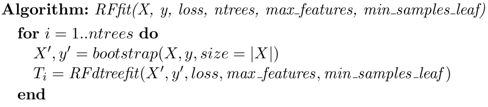
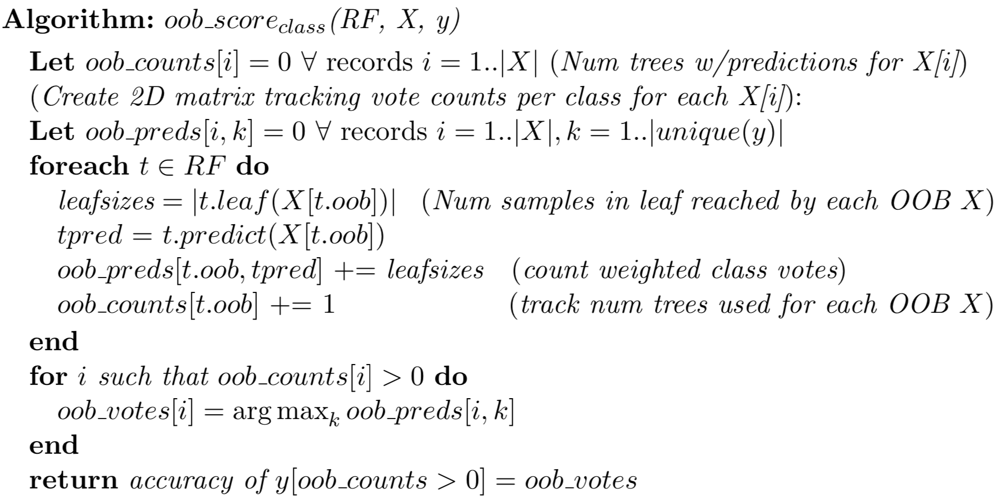

#  Random Forests

## Goal

The goal of this project is to code up the random forest algorithm from scratch with accuracy comparable to sklearn. 

This from-scratch implementation includes support for out-of-bag (OOB) validation error estimation. 


## Description

Classification and regression decision trees excel at fitting a model to training data. However, decision trees have a tendency to overfit, meaning that they may not generalize well to previously-unseen test data. To improve generality and combat overfitting, random forests use a collection of decision trees that have been weakened to make them more independent. Essentially, we are trading a bit of accuracy for a much greater improvement to generality. 

Random forests don't feed all data to every decision tree in its collection due to a technique known as bootstrapping, which involves resampling the data with replacement. Each tree is trained on a bootstrapped subset of the original training data. To increase independence further, RFs can occasionally drop some of the available features during training. In this implementation, decision node splitting will be limited to considering a random selection of features of size `max_features`. Naturally, both bootstrapping and setting a maximum features per split will introduce noise into the predictions of the individual decision trees. But, averaging the results of these weakened tree estimators squeezes the noise back down, giving us close to the best of both worlds!

### Bootstrapping

As briefly mentioned above, the purpose of bootstrapping for random forests is to train a number of decision trees that are as independent and identically distributed as possible by using different but similar training sets.  Each tree trains on a slightly different subset of the training data. Bootstrapping, in theory, pulls from the underlying distribution that generated the data to generate another independent sample. In practice, bootstrapping about 2/3 of the training data and leaving 1/3 for "out of bag" (OOB) validation is a good rule of thumb or starting point. 

The algorithm for fitting a random forest is below:



### Decision Trees

```
class DecisionNode:
    def __init__(self, col, split, lchild, rchild):
        self.col = col
        self.split = split
        self.lchild = lchild
        self.rchild = rchild
    def predict(self, x_test):
        ...
    def leaf(self, x_test):
        """
        Given a single test record, x_test, return the leaf node reached by running
        it down the tree starting at this node.  This is just like prediction,
        except we return the decision tree leaf rather than the prediction from that leaf.
        """
        ...
```

I went with a recursion based approach in this implementation, and it looks like:


For fitting conventional decision trees, `bestsplit()` exhaustively scans all available features and the feature values looking for the optimal variable/split combination. To reduce overfitting and promote independence amongst trees, each split should pick from a random subset of the features; the actual subset size is the hyperparameter `max_features`.  


### RF Prediction

Once we have our trained forest of decision trees, we can make predictions using `predict()`. For regression, the forest's prediction is simply the weighted average of the predictions from each individual decision trees. If `X_test` passed to `predict()` is a 2-D matrix of *n* rows, then *n* predictions will be returned as an array from `predict()`. To make a prediction for a single feature vector, call `leaf()` on each tree to get the leaf node that contains the prediction information. Each leaf has `n`, the number of observations in that leaf, which serves as our weight. The leaf also has a `prediction` that is the predicted y value for regression or class for classification. 

For classification, we need a majority vote across all trees.  As with regression, this implementation will sweep through all of the trees, and get the leaves associated with the prediction of a single feature vector. We then take the majority vote amongst all of leaf class predictions. Below is the prediction algorithm for regression and classification, respectively. 


###  Regressor and classifier class definitions

To mimic sklearn machine learning models, I created some class definitions. 

The `RandomForest` class has my generic `fit()` method that is inherited by subclasses `RandomForest Regressor` and `RandomForestClassifier`.  Field `n_estimators` is the number of trees in the forest.

Method `compute_oob_score()` is a helper method used to encapsulate OOB validation score functionality. `RandomForest.fit()` calls  `self.compute_oob_score()` and that method then calls the implementation either in regressor or classifier, depending on which object was created.

Below is a class-based UML diagram of rf.py:


## Out-of-bag (OOB) error

The advantage of OOB estimation is that the R^2 and accuracy scores are an accurate estimate of the validation error, all without having to manually hold out a validation or test set. This is another major advantage of random forests.

Generally, a bootstrapped sample is roughly 2/3 of the training records for any given tree, which leaves 1/3 of the samples (OOB) as test set. After training each decision tree, I keep track of the OOB records in the tree.  After training all trees in `fit()`, I loop through the trees again and compute the OOB score, if hyperparameter `self.oob_score` is true. The score is then saved in `self.oob_score_` for either the RF regressor or classifier object. Here are the OOB algorithms for regression and classification, respectively.




